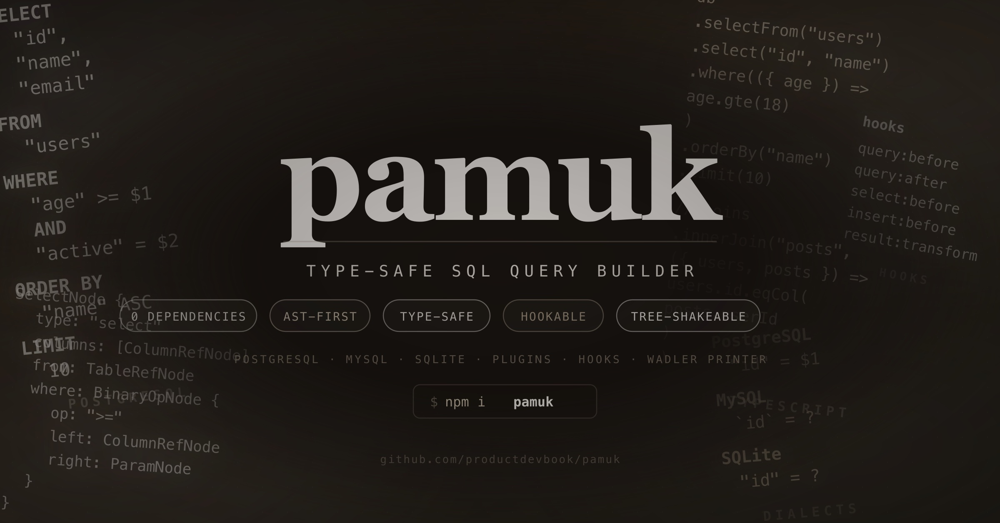

<p align="center">
  <br>
  
  <br><br>
  <b style="font-size: 2em;">pamuk</b>
  <br><br>
  Type-safe SQL query builder with powerful SQL printers.
  <br>
  Zero dependencies, AST-first, hookable, tree-shakeable. Pure TypeScript, works everywhere.
  <br><br>
  <a href="https://npmjs.com/package/pamuk"></a>
  <a href="https://npmjs.com/package/pamuk"></a>
  <a href="https://bundlephobia.com/result?p=pamuk"></a>
  <a href="https://github.com/productdevbook/pamuk/blob/main/LICENSE"></a>
</p>

## Quick Start

```sh
npm install pamuk
```

```ts
import { pamuk, pgDialect, serial, text, boolean, integer } from "pamuk";

const db = pamuk({
  dialect: pgDialect(),
  tables: {
    users: {
      id: serial().primaryKey(),
      name: text().notNull(),
      email: text().notNull(),
      active: boolean().defaultTo(true),
    },
    posts: {
      id: serial().primaryKey(),
      title: text().notNull(),
      userId: integer().references("users", "id"),
    },
  },
});
```

## Query Building

```ts
// SELECT
db.selectFrom("users")
  .select("id", "name")
  .where(({ age, active }) => and(age.gte(18), active.eq(true)))
  .orderBy("name")
  .limit(10)
  .compile(db.printer());
// → SELECT "id", "name" FROM "users" WHERE ("age" >= $1 AND "active" = $2) ORDER BY "name" ASC LIMIT 10

// INSERT
db.insertInto("users")
  .values({
    name: "Alice",
    email: "alice@example.com",
  })
  .returningAll()
  .compile(db.printer());

// UPDATE
db.update("users")
  .set({ active: false })
  .where(({ id }) => id.eq(1))
  .compile(db.printer());

// DELETE
db.deleteFrom("users")
  .where(({ id }) => id.eq(1))
  .returning("id")
  .compile(db.printer());
```

## Joins

```ts
db.selectFrom("users")
  .innerJoin("posts", ({ users, posts }) => users.id.eqCol(posts.userId))
  .compile(db.printer());
// → SELECT * FROM "users" INNER JOIN "posts" ON ("users"."id" = "posts"."userId")
```

## Tree Shaking

Import only the dialect you need:

```ts
import { pamuk } from "pamuk";
import { pgDialect } from "pamuk/pg";
import { mysqlDialect } from "pamuk/mysql";
import { sqliteDialect } from "pamuk/sqlite";
import { serial, text } from "pamuk/schema";
```

## Dialects

Same query, different SQL:

```ts
// PostgreSQL  → SELECT "id" FROM "users" WHERE ("id" = $1)
// MySQL       → SELECT `id` FROM `users` WHERE (`id` = ?)
// SQLite      → SELECT "id" FROM "users" WHERE ("id" = ?)
```

## Plugins

```ts
import { WithSchemaPlugin, SoftDeletePlugin, CamelCasePlugin } from "pamuk";

const db = pamuk({
  dialect: pgDialect(),
  plugins: [
    new WithSchemaPlugin("public"),
    new SoftDeletePlugin({ tables: ["users"] }),
  ],
  tables: { ... },
});

// SELECT * FROM "public"."users" WHERE ("deleted_at" IS NULL)
```

## Hooks

```ts
// Query logging
db.hook("query:after", (ctx) => {
  console.log(`[SQL] ${ctx.query.sql}`);
});

// Add request tracing
db.hook("query:after", (ctx) => {
  return {
    ...ctx.query,
    sql: `${ctx.query.sql} /* request_id=${requestId} */`,
  };
});

// Modify AST before compilation
db.hook("select:before", (ctx) => {
  // Add tenant isolation, audit filters, etc.
});

// Transform results
db.hook("result:transform", (rows) => {
  return rows.map(toCamelCase);
});

// Unregister
const off = db.hook("query:before", handler);
off();
```

## Expression API

```ts
.where(({ id }) => id.eq(42))              // "id" = $1
.where(({ name }) => name.like("%ali%"))    // "name" LIKE '%ali%'
.where(({ age }) => age.between(18, 65))    // "age" BETWEEN $1 AND $2
.where(({ id }) => id.in([1, 2, 3]))       // "id" IN ($1, $2, $3)
.where(({ bio }) => bio.isNull())           // "bio" IS NULL
.where(({ email }) => email.isNotNull())    // "email" IS NOT NULL
.where(({ a, b }) =>                        // ("a" > $1 AND "b" != $2)
  and(a.gt(0), b.neq("x")),
)
.where(({ a, b }) =>                        // ("a" = $1 OR "b" = $2)
  or(a.eq(1), b.eq(2)),
)
```

## Why lale?

|                    | lale              | Drizzle         | Kysely         |
| ------------------ | ----------------- | --------------- | -------------- |
| **Architecture**   | AST-first         | Template        | AST (98 nodes) |
| **Type inference** | Auto (no codegen) | Auto            | Manual DB type |
| **Plugin system**  | Hooks + plugins   | None            | Plugins only   |
| **SQL printer**    | Wadler algebra    | Template concat | String append  |
| **Dependencies**   | 0                 | 0               | 0              |
| **Node types**     | ~35 (focused)     | Config objects  | 98 (complex)   |
| **API style**      | Callback proxy    | Method chain    | Method chain   |

## Architecture

```
Schema → Builder → AST → Plugin/Hook → Printer → SQL
```

- **Schema Layer** — `defineTable()`, `ColumnType<S,I,U>`, auto type inference
- **Builder Layer** — `Lale<DB>`, `TypedSelectBuilder<DB,TB,O>`, proxy-based expressions
- **AST Layer** — ~35 frozen node types, discriminated unions, visitor pattern
- **Plugin Layer** — `LalePlugin` interface, `Hookable` lifecycle hooks
- **Printer Layer** — `BasePrinter` with dialect subclasses, Wadler document algebra

## License

[MIT](./LICENSE)
